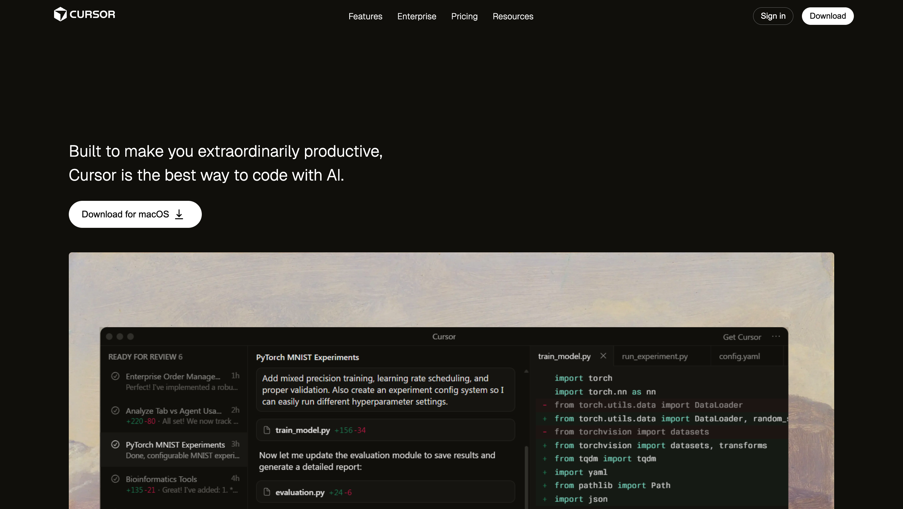

# Cursor Clone - Landing Page

A pixel-perfect recreation of the Cursor AI Code Editor landing page, built with vanilla HTML, CSS, and Vite.

## 📸 Preview


## 🚀 Features

- **Modern Design**: Clean, minimalist UI with a dark theme
- **Responsive Layout**: Optimized for various screen sizes
- **Custom Typography**: Uses Geist and Inter fonts for a premium look
- **Layered Images**: Artistic background with overlaid IDE screenshot
- **Smooth Animations**: Subtle hover effects and transitions
- **Fast Performance**: Built with Vite for lightning-fast development and builds

## 🛠️ Tech Stack

- **HTML5** - Semantic markup
- **CSS3** - Custom properties, Flexbox, and modern styling
- **Vite** - Build tool and dev server
- **Google Fonts** - Geist & Inter typography

## 📦 Installation

1. **Clone the repository**
   ```bash
   git clone https://github.com/yourusername/cursor_clone.git
   cd cursor_clone
   ```

2. **Install dependencies**
   ```bash
   npm install
   ```

3. **Start the development server**
   ```bash
   npm run dev
   ```

4. **Open your browser**
   
   Navigate to `http://localhost:5173` (or the port shown in your terminal)

## 🏗️ Build for Production

```bash
npm run build
```

The optimized build will be generated in the `dist` folder.

## 👀 Preview Production Build

```bash
npm run preview
```

## 📁 Project Structure

```
cursor_clone/
├── public/              # Static assets
│   ├── download.svg     # Logo
│   ├── download-svgrepo-com.svg  # Download icon
│   ├── imgi_1_image.webp         # Background image
│   └── Screenshot...svg          # IDE overlay
├── src/
│   └── style.css        # Main stylesheet
├── index.html           # Entry point
├── package.json         # Dependencies
└── README.md           # Documentation
```

## 🎨 Customization

### Colors

Edit CSS variables in `src/style.css`:

```css
:root {
  --bg-color: #14120B;
  --text-primary: #ffffff;
  --text-secondary: #000000;
  --accent-color: #ffffff;
  --border-color: #808080;
}
```

### Fonts

Modify the Google Fonts import in `index.html` to use different typefaces.

## 🌐 Deployment

### Vercel (Recommended)

1. Push your code to GitHub
2. Import the repository in [Vercel](https://vercel.com)
3. Deploy with default Vite settings

### Netlify

1. Run `npm run build`
2. Drag and drop the `dist` folder to [Netlify](https://netlify.com)

### GitHub Pages

```bash
npm run build
# Deploy the dist folder to gh-pages branch
```

## 📝 License

This project is open source and available under the [MIT License](LICENSE).

## 🙏 Acknowledgments

- Design inspired by [Cursor](https://cursor.sh)
- Built as a learning project to practice modern web development

---

**Note**: This is a clone project for educational purposes. All rights to the original design belong to Cursor.
